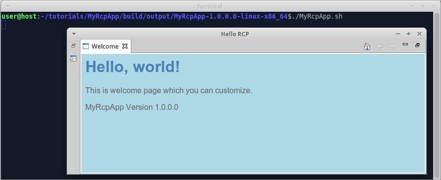

We already [added splash to RCP app](Add-splash-to-RCP-app). Now we add intro page to RCP app.

1. Create folder "tutorials/MyRcpApp/src/main/resources/intro", create file "welcome.html" in it, insert code:

  ```html
  <html>
    <head>
      <meta charset="UTF-8">
      <title>Welcome page</title>
      <link rel="stylesheet" type="text/css" href="default.css">
    </head>
    <body>
      <h1>Hello, world!</h1>
      <p>This is welcome page which you can customize.</p>
      <p>${project.name} Version ${project.version}</p>
    </body>
  </html>
  ```

2. Create file "default.css" in the same folder, insert code:

  ```css
  body {
    font-family: Arial;
    background-color: LightBlue;
    color: DimGray;
  }

  h1 {
    color: SteelBlue;
  }
  ```

3. Invoke on command line in "tutorials" folder:

  ```shell
  gradle build
  ```
  
  Note that you don't have to configure intro page in configuration files - wuff does this for you automatically.

4. Run the compiled product from command line. When the program is started for the first time, it displays intro page:

  
  
  Note that intro page is filtered with groovy.text.SimpleTemplateEngine, so you can render arbitrary content on intro page with the help of java and groovy functions.

  As soon as you close intro page, you see the default perspective:

  

The example code for this page: [tutorialExamples/RcpApp-6](../tree/master/tutorialExamples/RcpApp-6).

Next page: [Localize RCP app](Localize-RCP-app).