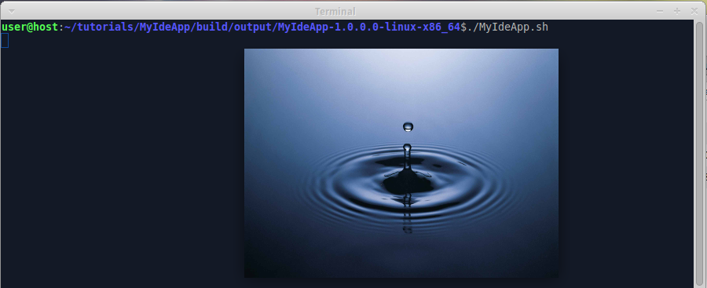

We already [added perspective and view to IDE app](Add-perspective-and-view-to-IDE-app). Now we add splash screen to the IDE app.

1. Download or create some bmp-file with bit depth 8 or 24 (not 32). Name it "splash.bmp".

2. Create folder "tutorials/MyIdeApp/src/main/resources", copy splash file into it.

3. Invoke on command line in "tutorials/MyIdeApp" folder:

  ```shell
  gradle build
  ```

  Note that we don't have to configure splash screen in configuration files - wuff does this for us automatically.
  
4. Run the compiled product from command line. The program shows splash screen while starting:

  

The example code for this page: [tutorialExamples/IdeApp-5](../tree/master/tutorialExamples/IdeApp-5).

Next page: [Add intro page to IDE app](Add-intro-page-to-IDE-app).