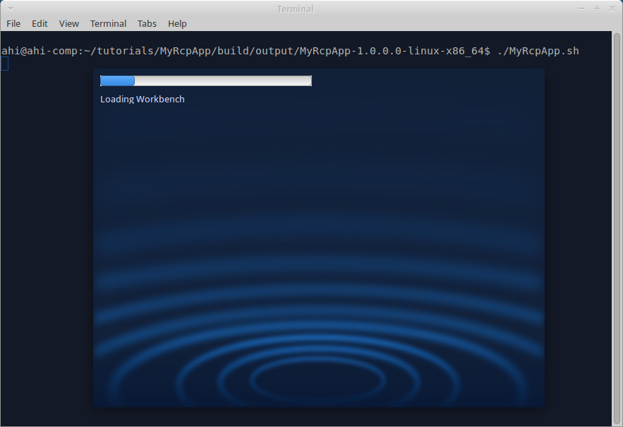

We already [created Eclipse bundle and used it in RCP app](Create-Eclipse-bundle-and-use-it-in-RCP-app). Now we add splash screen to the RCP app.

### Prepare splash screen

Download or create some bmp-file with bit depth 8 or 24 (not 32). Name it "splash.bmp".

Create folder "tutorials/MyRcpApp/src/main/resources", copy splash file into it. Alternatively, we can store splash screen in "tutorials/MyRcpApp".

### Compile

Invoke on command line in "tutorials" folder: `gradle build`

Note that we don't have to configure splash screen in configuration files - wuff does this for us automatically.

### Run

Run the compiled product from command line. The program shows splash screen while starting:

---

The example code for this page: [tutorialExamples/RcpApp-5](../tree/master/tutorialExamples/RcpApp-5).

Next page: [Add intro page to RCP app](Add-intro-page-to-RCP-app).