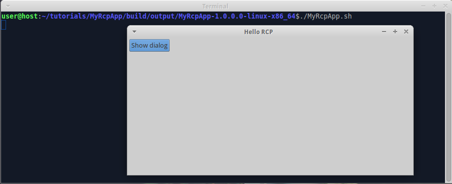
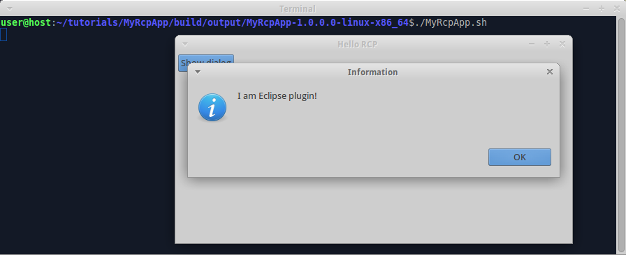

We already [created Eclipse bundle and used it in RCP app](Create-Eclipse-bundle-and-use-it-in-RCP-app). Now we add splash screen to the RCP app.

1. Download or create some bmp-file with bit depth 8 or 24 (not 32). Name it "splash.bmp".

2. Create folder "tutorials/MyRcpApp/src/main/resources", copy splash file into it.

3. Invoke on command line in "tutorials" folder:

  ```shell
  gradle build
  ```

  Note that you don't have to configure splash screen in configuration files - wuff does this for you automatically.
  
4. Run the compiled product from command line. The program shows splash screen while starting:

  
   
  As soon as main window is shown, splash screen disappears and default perspective is shown:

  

  When you click on "Show dialog" button, the program shows message dialog:

  

The example code for this page: [tutorialExamples/RcpApp-5](../tree/master/tutorialExamples/RcpApp-5).

Next page: [Add intro page to RCP app](Add-intro-page-to-RCP-app).