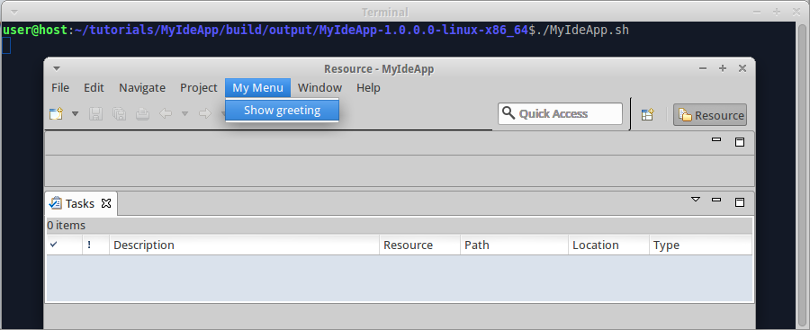

We already [prepared IDE app for multiproject build](Prepare-IDE-app-for-multiproject-build). Now we create IDE plugin and use it in IDE app.

1. Create folder "tutorials/MyIdePlugin", create file "build.gradle" in it, insert code:

  ```groovy
  apply plugin: 'java'
  apply plugin: 'eclipse-ide-bundle'

  dependencies {
    compile "${eclipseMavenGroup}:org.eclipse.core.commands:+"
  }
  ```
  We add dependency on org.eclipse.core.commands because we are going to implement menu handler.

2. Create folder "tutorials/MyIdePlugin/src/main/java/myideplugin", create file "MenuHandler.java" in it, insert code:

  ```java
  package myideplugin;

  import org.eclipse.core.commands.AbstractHandler;
  import org.eclipse.core.commands.ExecutionEvent;
  import org.eclipse.core.commands.ExecutionException;
  import org.eclipse.jface.dialogs.MessageDialog;
  import org.eclipse.ui.PlatformUI;

  public final class MenuHandler extends AbstractHandler {

    @Override
    public Object execute(ExecutionEvent event) throws ExecutionException {
      MessageDialog.openInformation(PlatformUI.getWorkbench().getActiveWorkbenchWindow().getShell(), "Information", "Hello, world!");
      return null;
    }
  }
  ```
3. Create folder "tutorials/MyIdePlugin/src/main/resources/myideplugin", create file "plugin.xml" in it, insert code:

  ```xml
  <?xml version="1.0" encoding="UTF-8"?>
  <?eclipse version="3.4"?>
  <plugin>
    <extension point="org.eclipse.ui.commands">
      <command id="cmdHelloWorld" name="Show greeting" defaultHandler="myideplugin.MenuHandler">
      </command>
    </extension>
    <extension point="org.eclipse.ui.menus">
      <menuContribution allPopups="true" locationURI="menu:org.eclipse.ui.main.menu?after=additions">
        <menu id="MyMenu" label="My Menu">
          <command commandId="cmdHelloWorld" style="push"/>
        </menu>
      </menuContribution>
    </extension>
  </plugin>
  ```

4. Edit file "tutorials/settings.gradle", insert code:

  ```groovy
  include 'MyIdePlugin'
  ```
  so that there are two includes - "MyIdeApp" and "MyIdePlugin".

5. Edit file "tutorials/MyIdeApp/build.gradle", insert code:

  ```groovy
  dependencies {
    compile project(':MyIdePlugin')
  }
  ```

6. Invoke on command line in "tutorials" folder: `gradle build`

  **CHECK:** folder "tutorials/MyIdePlugin/build/libs" contains file "MyIdePlugin-1.0.0.0.jar", which is proper OSGi bundle with automatically generated manifest.

  **CHECK:** Each product in "tutorials/MyIdeApp/build/output" contains "MyIdePlugin" and "MyIdeApp" bundles in "plugins" subfolder and in "configuration/config.ini". 

7. Run the compiled product from command line. Fully started program looks like Eclipse IDE with "Resource" perspective. Main menu contains new submenu "My Menu" with menu item "Show greeting":

  

  When you click "Show greeting", the program shows message dialog:

  

The example code for this page: [tutorialExamples/IdeApp-4](../tree/master/tutorialExamples/IdeApp-4).

Next page: [add perspective and view to IDE app](Add-perspective-and-view-to-IDE-app).