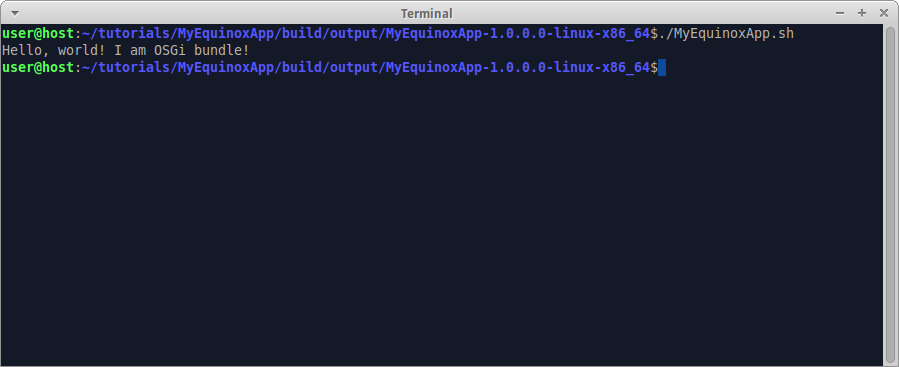

We already [prepared Equinox app for multiproject build](Prepare-Equinox-app-for-multiproject-build). Now we create OSGi-bundle and use it in Equinox app.

### Create OSGi bundle

Create folder "tutorials/MyBundle", create file "build.gradle" in it, insert code:

```groovy
apply plugin: 'java'
apply plugin: 'osgi-bundle'
```

Create folder "tutorials/MyBundle/src/main/java/mybundle", create file "HelloWorld.java" in it, insert code:

```java
package mybundle;

public class HelloWorld {

  public static void sayHello() {
    System.out.println("Hello, world! I am OSGi bundle!");
  }
}
```

Edit file "tutorials/settings.gradle", insert code:

```groovy
include 'MyBundle'
```
so that there are two includes - "MyEquinoxApp" and "MyBundle".

### Use OSGi bundle in Equinox app

Edit file "tutorials/MyEquinoxApp/build.gradle", insert code:

```groovy
dependencies {
  compile project(':MyBundle')
}
```

Edit file "tutorials/MyEquinoxApp/src/main/java/myequinoxapp/Application.java", replace line containing `System.out.println` with `mybundle.HelloWorld.sayHello();` so that the file looks like this:

```java
package myequinoxapp;

import java.io.IOException;

import org.eclipse.equinox.app.IApplication;
import org.eclipse.equinox.app.IApplicationContext;

public class Application implements IApplication {

  @Override
  public Object start(IApplicationContext ctx) throws Exception {
    mybundle.HelloWorld.sayHello();
    return IApplication.EXIT_OK;
  }

  @Override
  public void stop() {
    // From eclipse doc:
    // This method will not be called if an application exits normally from the start(IApplicationContext) method. 
  }
}
```

### Compile

Invoke on command line in "tutorials" folder: `gradle build`

Check: folder "tutorials/MyBundle/build/libs" must contain file "MyBundle-1.0.0.0.jar", which is proper OSGi bundle with automatically generated manifest.

Check: each product in "tutorials/MyEquinoxApp/build/output" must contain "MyBundle" and "MyEquinoxApp" bundles in "plugins" subfolder and in "configuration/config.ini". 

### Run

Run the compiled product from command line. The expected output:

 

---

The example code for this page: [tutorialExamples/EquinoxApp-4](../tree/master/tutorialExamples/EquinoxApp-4).

Now we are done with building Equinox app. Now we can go back to [wiki pages home](Home) and learn something else.
