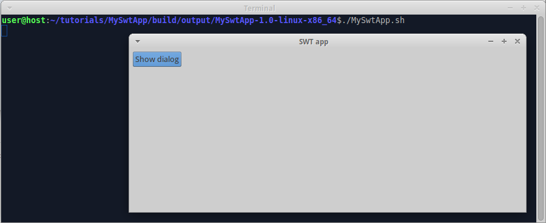
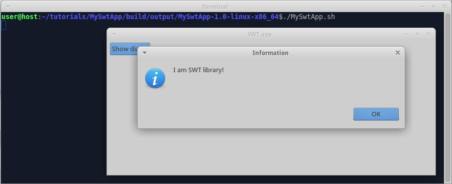

We already [prepared SWT app for multiproject build](Prepare-SWT-app-for-multiproject-build). Now we create SWT library and use it in SWT app.

### Create SWT library

Create folder "tutorials/MySwtLib", create file "build.gradle" in it, insert code:

```groovy
apply plugin: 'java'
apply plugin: 'swt-lib'
```

Create folder "tutorials/MySwtLib/src/main/java/myswtlib", create file "HelloWorld.java" in it, insert code:

```java
package myswtlib;

import org.eclipse.jface.dialogs.MessageDialog;
import org.eclipse.swt.widgets.Shell;

public class HelloWorld {

  public static void showMessageDialog(Shell shell) {
    MessageDialog.openQuestion(shell, "Information", "I am SWT library!");
  }
}
```

Edit file "tutorials/settings.gradle", insert code:

```groovy
include 'MySwtLib'
```
so that there are two includes - "MySwtApp" and "MySwtLib".

### Use SWT library in SWT app

Edit file "tutorials/MySwtApp/build.gradle", insert code:

```groovy
dependencies {
  compile project(':MySwtLib')
}
```

Edit file "tutorials/MySwtApp/src/main/java/myswtapp/Main.java", replace content with:

```groovy
package myswtapp;

import org.eclipse.jface.dialogs.MessageDialog;
import org.eclipse.swt.SWT;
import org.eclipse.swt.events.SelectionAdapter;
import org.eclipse.swt.events.SelectionEvent;
import org.eclipse.swt.layout.GridData;
import org.eclipse.swt.layout.GridLayout;
import org.eclipse.swt.widgets.Button;
import org.eclipse.swt.widgets.Display;
import org.eclipse.swt.widgets.Shell;

import myswtlib.HelloWorld;

public final class Main {

  public static void main(String[] args) {
    Display display = new Display();
    try {
      final Shell shell = new Shell(display);
      shell.setText("SWT app");
      shell.setLayout(new GridLayout(5, true));
      Button btnShowDialog = new Button(shell, SWT.PUSH);
      btnShowDialog.setText("Show dialog");
      btnShowDialog.setLayoutData(new GridData());
      btnShowDialog.addSelectionListener(new SelectionAdapter() {
        @Override
        public void widgetSelected(SelectionEvent event) {
          HelloWorld.showMessageDialog(shell);
        }
      });
      shell.open();
      while (!shell.isDisposed())
        if (!display.readAndDispatch())
          display.sleep();
    } finally {
      display.dispose();
    }
  }
}
```

### Compile

Invoke on command line in "tutorials" folder: `gradle build`

Check: folder "tutorials/MySwtLib/build/libs" must contain file "MySwtLib-1.0.jar", which is non-OSGi library.

Check: each product in "tutorials/MySwtApp/build/output" must contain monolithic JAR and launch scripts.

Check: each monolithic JAR must contain "MySwtApp" library in "main" folder and "MySwtLib" library in "lib" folder. 

### Run

Run the compiled product from command line. Expect to see:
 


When we click on "Show dialog" button, the program shows message dialog:



---

The example code for this page: [tutorialExamples/SwtApp-4](../tree/master/tutorialExamples/SwtApp-4).

Next page: [localize SWT app](Localize-SWT-app).