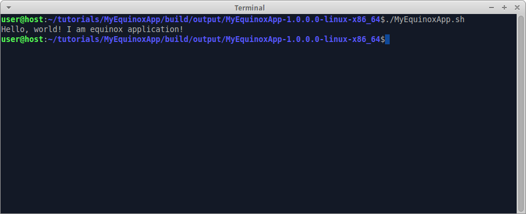

In this chapter we start from scratch and build Equinox app.

### Create "build.gradle"

Create folder "tutorials/MyEquinoxApp", create file "build.gradle" in it, insert code:

```groovy
buildscript {
  repositories {
    mavenLocal()
    jcenter()
  }
  
  dependencies {
    classpath 'org.akhikhl.wuff:wuff-plugin:0.0.2'
  }
}

apply plugin: 'java'
apply plugin: 'eclipse-equinox-app'

repositories {
  mavenLocal()
  jcenter()
}
```

The script describes that we are using wuff gradle-plugin
and that we apply "eclipse-equinox-app" plugin to this project.

### Generate default sources

Invoke on command line: `gradle scaffold`. Scaffold task creates Application class required by equinox library.

### Compile

Invoke on command line: `gradle build`.

Check: folder "tutorials/MyEquinoxApp/build/libs" must contain file "MyEquinoxApp-1.0.0.0.jar", which is proper OSGi bundle with automatically generated manifest and "plugin.xml".

Check: folder "tutorials/MyEquinoxApp/build/output" must contain equinox product.

Check: the product must contain "MyEquinoxApp" bundle in "plugins" subfolder and in "configuration/config.ini".

Attention: first build might be slow, because Wuff downloads Eclipse and installs it's bundles into local maven repository ($HOME/.m2/repository). Consequent builds will be much faster.

Note: we don't have to program "plugin.xml", "MANIFEST.MF", "config.ini" - all these files are generated and inserted into the bundle and the product automatically.

### Run

Run the compiled product from command line. The expected output:
 
 

---

The example code for this page: [examples/EquinoxApp-1](../tree/master/examples/EquinoxApp-1).

Next page: [Configure Equinox products](Configure-Equinox-products).