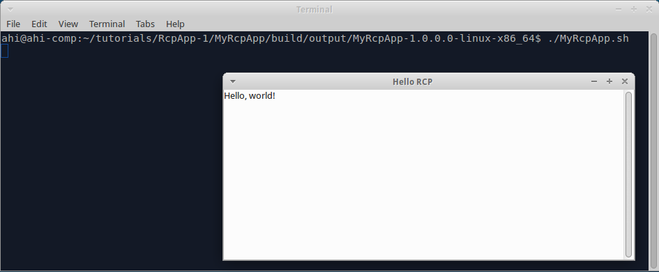

In this tutorial we start from scratch and build RCP app.

### Create "build.gradle"

Create folder "tutorials/MyRcpApp", create file "build.gradle" in it, insert code:

```groovy
buildscript {
  repositories {
    mavenLocal()
    jcenter()
  }

  dependencies {
    classpath 'org.akhikhl.wuff:wuff-plugin:0.0.1'
  }
}

apply plugin: 'java'
apply plugin: 'eclipse-rcp-app'

repositories {
  mavenLocal()
  jcenter()
}
```

The script describes that we are using wuff gradle-plugin and that we apply "eclipse-rcp-app" plugin to this project.

### Generate default sources

Invoke on command line: `gradle scaffold`. Scaffold task creates classes required by Eclipse RCP.

### Compile

Invoke on command line: `gradle build`.

Check: folder "tutorials/MyRcpApp/build/libs" must contain file "MyRcpApp-1.0.0.0.jar", which is proper OSGi bundle with automatically generated manifest and "plugin.xml".

Check: there must be one product in "tutorials/MyRcpApp/build/output" folder. 

Check: the product must contain "MyRcpApp" bundle in "plugins" subfolder and in "configuration/config.ini". 

Attention: first build might be slow, because Wuff downloads Eclipse and installs it's bundles into local maven repository ($HOME/.m2/repository). Consequent builds will be much faster.

Note that we don't have to program "plugin.xml", "MANIFEST.MF", "config.ini" - all these files are generated and inserted into bundle and product automatically.

### Run

Run the compiled product from command line. Expect to see:
 


---

The example code for this page: [examples/RcpApp-1](../tree/master/examples/RcpApp-1).

Next page: [Configure RCP products](Configure-RCP-products).