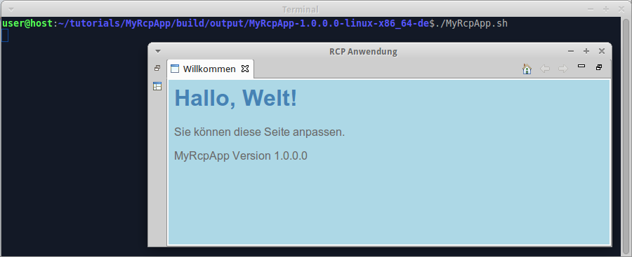
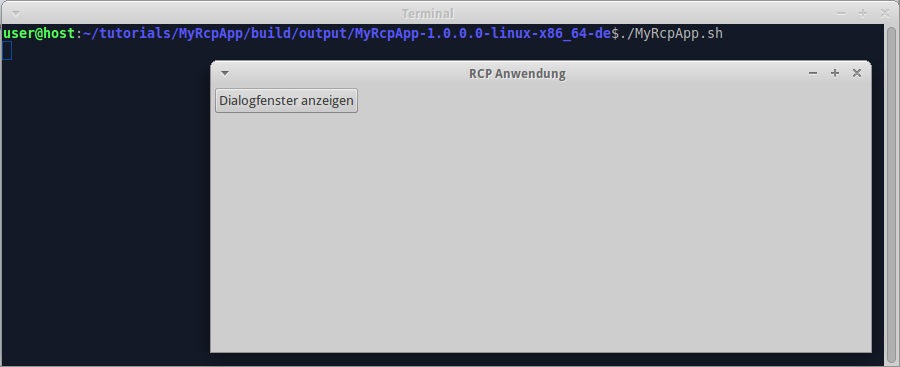
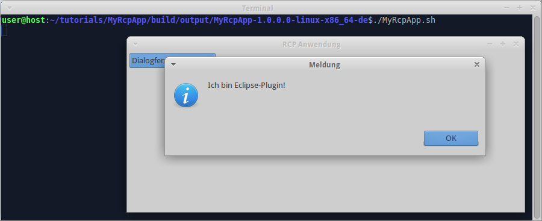

We already [added intro page to RCP app](Add-intro-page-to-RCP-app). Now we localize RCP app.

### Enable eclipse language pack

Edit "tutorials/build.gradle", insert code:

apply plugin: 'eclipse-config'

wuff {
  languagePack 'de'
}

Hint: you could place wuff/languagePack instruction to "build.gradle" in RCP app or in any of it's ancestor projects. 'eclipse-config' is needed when neither 'eclipse-rcp-app' nor 'eclipse-ide-app' are already applied in the same project.

### Create language-specific product definitions

Edit "tutorials/MyRcpApp/build.gradle", insert code:

```groovy
products {
  product platform: 'linux', arch: 'x86_32'
  product platform: 'linux', arch: 'x86_32', language: 'de'
  product platform: 'linux', arch: 'x86_64'
  product platform: 'linux', arch: 'x86_64', language: 'de'
  product platform: 'windows', arch: 'x86_32'
  product platform: 'windows', arch: 'x86_32', language: 'de'
  product platform: 'windows', arch: 'x86_64'
  product platform: 'windows', arch: 'x86_64', language: 'de'
  archiveProducts = true
}
```

Here we define 8 products: 4 are English, 4 are German.

### Localize messages

Create file "tutorials/MyRcpApp/src/main/java/myrcpapp/Messages.java", insert code:

```java
package myrcpapp;

import java.util.Locale;
import java.util.ResourceBundle;

public class Messages {

  private static ResourceBundle res = ResourceBundle.getBundle(Messages.class.getName(), Locale.getDefault());
  
  public static String getString(String key) {
    return res.getString(key);
  }  
}
```

Edit file "tutorials/MyRcpApp/src/main/java/myrcpapp/View.java", replace line `btnShowDialog.setText("Show dialog");` with `btnShowDialog.setText(Messages.getString("btnShowDialog_Label"));`, so that the file looks like this:

```java
package myrcpapp;

import org.eclipse.swt.SWT;
import org.eclipse.swt.widgets.Composite;
import org.eclipse.swt.events.SelectionAdapter;
import org.eclipse.swt.events.SelectionEvent;
import org.eclipse.swt.layout.RowLayout;
import org.eclipse.swt.widgets.Button;
import org.eclipse.ui.part.ViewPart;

public class View extends ViewPart {

  @Override
  public void createPartControl(final Composite parent) {
    parent.setLayout(new RowLayout());
    Button btnShowDialog = new Button(parent, SWT.PUSH);
    btnShowDialog.setText(Messages.getString("btnShowDialog_Label"));
    btnShowDialog.addSelectionListener(new SelectionAdapter() {
      @Override
      public void widgetSelected(SelectionEvent event) {
        myplugin.HelloWorld.showMessageDialog(parent.getShell());
      }
    });
  }

  @Override
  public void setFocus() {
  }
}
```

Edit file "tutorials/MyRcpApp/src/main/java/myrcpapp/ApplicationWorkbenchWindowAdvisor.java", replace line `configurer.setTitle("Hello RCP");` with `configurer.setTitle(Messages.getString("WindowTitle"));`, so that the file looks like this:

```java
package myrcpapp;

import org.eclipse.swt.graphics.Point;
import org.eclipse.ui.application.ActionBarAdvisor;
import org.eclipse.ui.application.IActionBarConfigurer;
import org.eclipse.ui.application.IWorkbenchWindowConfigurer;
import org.eclipse.ui.application.WorkbenchWindowAdvisor;

public class ApplicationWorkbenchWindowAdvisor extends WorkbenchWindowAdvisor {

  public ApplicationWorkbenchWindowAdvisor(IWorkbenchWindowConfigurer configurer) {
    super(configurer);
  }

  public ActionBarAdvisor createActionBarAdvisor(IActionBarConfigurer configurer) {
    return new ApplicationActionBarAdvisor(configurer);
  }
  
  public void preWindowOpen() {
    IWorkbenchWindowConfigurer configurer = getWindowConfigurer();
    configurer.setInitialSize(new Point(400, 300));
    configurer.setShowCoolBar(false);
    configurer.setShowStatusLine(false);
    configurer.setTitle(Messages.getString("WindowTitle"));
  }
}
```

Create folder "tutorials/MyRcpApp/src/main/resources/myrcpapp", create file "Messages.properties" in it, insert content:

```
WindowTitle=RCP application
btnShowDialog_Label=Show dialog
```

Create file "Messages_de.properties" in the same folder, insert content:

```
WindowTitle=RCP Anwendung
btnShowDialog_Label=Dialogfenster anzeigen
```

Create file "tutorials/MyPlugin/src/main/java/myplugin/Messages.java", insert code:

```java
package myplugin;

import java.util.Locale;
import java.util.ResourceBundle;

public class Messages {

  private static ResourceBundle res = ResourceBundle.getBundle(Messages.class.getName(), Locale.getDefault());
  
  public static String getString(String key) {
    return res.getString(key);
  }  
}
```

Edit file "tutorials/MyPlugin/src/main/java/myplugin/HelloWorld.java", replace line `MessageDialog.openInformation(shell, "Information", "Hello, world!");` with `MessageDialog.openInformation(shell, Messages.getString("DialogTitle"), Messages.getString("DialogMessage"));`, so that the file looks like this:

```java
package myplugin;

import org.eclipse.jface.dialogs.MessageDialog;
import org.eclipse.swt.widgets.Shell;

public class HelloWorld {

  public static void showMessageDialog(Shell shell) {
    MessageDialog.openInformation(shell, Messages.getString("DialogTitle"), Messages.getString("DialogMessage"));
  }
}
```

Create folder "tutorials/MyPlugin/src/main/resources/myplugin", create file "Messages.properties" in it, insert content:

```
DialogTitle=Message
DialogMessage=Hello, world!
```

Create file "Messages_de.properties" in the same folder, insert content:

```
DialogTitle=Meldung
DialogMessage=Hallo, Welt!
```

### Localize intro page

Create folder "tutorials/MyRcpApp/src/main/resources/nl/de/intro", then copy all files from "tutorials/MyRcpApp/src/main/resources/intro" into it.

Edit file "tutorials/MyRcpApp/src/main/resources/nl/de/intro/welcome.html", replace content with:

```html
<html>
  <head>
    <meta charset="UTF-8">
    <title>Willkommen</title>
    <link rel="stylesheet" type="text/css" href="default.css">
  </head>
  <body>
    <h1>Hallo, Welt!</h1>
    <p>Sie können diese Seite anpassen.</p>
    <p>${project.name} Version ${project.version}</p>
  </body>
</html>
```

### Compile

Invoke on command line in "tutorials" folder: `gradle build`.

### Run

Run the German-language product from command line. When the program is started for the first time, it displays intro page:



Note that localized intro page is also filtered with groovy.text.SimpleTemplateEngine, so we can render arbitrary content on intro page with the help of java and groovy functions.

As soon as we close intro page, we see the default perspective with button. The button has localized text:



When we click the button, the program displays localized message:



---

The example code for this page: [examples/RcpApp-7](../tree/master/examples/RcpApp-7).

We are done with building RCP app. Now we can go back to [wiki home page](Home) and learn something else.
