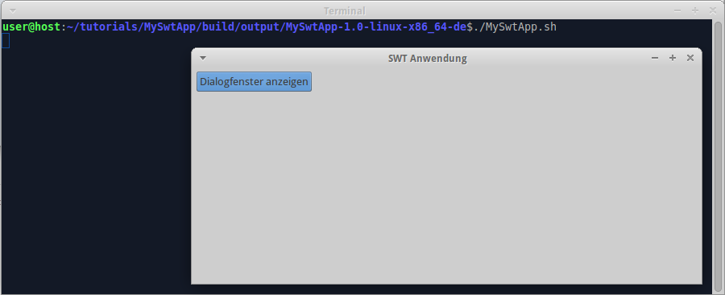
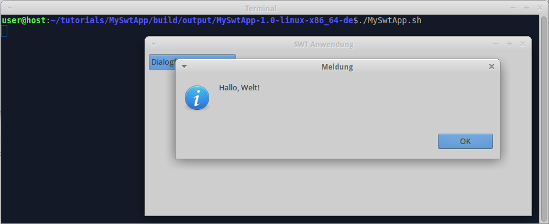

We already [created SWT library and used it in SWT app](Create-SWT-library-and-use-it-in-SWT-app). Now we localize SWT app.

### Enable eclipse language pack

Edit "tutorials/build.gradle", insert code:

```groovy
apply plugin: 'org.akhikhl.wuff.eclipse-config'

wuff {
  languagePack 'de'
}
```

Hint: you could place wuff/languagePack instruction to "build.gradle" in SWT app or in any of it's ancestor projects. 'eclipse-config' is needed for Wuff configuration when none of other Wuff plugins are already applied in the same project.

### Create language-specific product definitions

Edit "tutorials/MySwtApp/build.gradle", insert code:

```groovy
products {
  product platform: 'linux', arch: 'x86_32'
  product platform: 'linux', arch: 'x86_32', language: 'de'
  product platform: 'linux', arch: 'x86_64'
  product platform: 'linux', arch: 'x86_64', language: 'de'
  product platform: 'windows', arch: 'x86_32'
  product platform: 'windows', arch: 'x86_32', language: 'de'
  product platform: 'windows', arch: 'x86_64'
  product platform: 'windows', arch: 'x86_64', language: 'de'
  product platform: 'macosx', arch: 'x86_64'
  product platform: 'macosx', arch: 'x86_64', language: 'de'
  archiveProducts = true
}
```

Here we define 10 products: 5 are English, 5 are German.

### Localize messages

Create file "tutorials/MySwtApp/src/main/java/myswtapp/Messages.java", insert code:

```java
package myswtapp;

import java.util.Locale;
import java.util.ResourceBundle;

public class Messages {

  private static ResourceBundle res = ResourceBundle.getBundle(Messages.class.getName(), Locale.getDefault());
  
  public static String getString(String key) {
    return res.getString(key);
  }  
}
```

Edit file "tutorials/MySwtApp/src/main/java/myswtapp/Main.java", replace literal strings, so that file looks like this:

```java
package myswtapp;

import org.eclipse.jface.dialogs.MessageDialog;
import org.eclipse.swt.SWT;
import org.eclipse.swt.events.SelectionAdapter;
import org.eclipse.swt.events.SelectionEvent;
import org.eclipse.swt.layout.GridData;
import org.eclipse.swt.layout.GridLayout;
import org.eclipse.swt.widgets.Button;
import org.eclipse.swt.widgets.Display;
import org.eclipse.swt.widgets.Shell;

import myswtlib.HelloWorld;

public final class Main {

  public static void main(String[] args) {
    Display display = new Display();
    try {
      final Shell shell = new Shell(display);
      shell.setText(Messages.getString("WindowTitle"));
      shell.setLayout(new GridLayout(5, true));
      Button btnShowDialog = new Button(shell, SWT.PUSH);
      btnShowDialog.setText(Messages.getString("btnShowDialog_Label"));
      btnShowDialog.setLayoutData(new GridData());
      btnShowDialog.addSelectionListener(new SelectionAdapter() {
        @Override
        public void widgetSelected(SelectionEvent event) {
          HelloWorld.showMessageDialog(shell);
        }
      });
      shell.open();
      while (!shell.isDisposed())
        if (!display.readAndDispatch())
          display.sleep();
    } finally {
      display.dispose();
    }
  }
}
```

Create folder "tutorials/MySwtApp/src/main/resources/myswtapp", create file "Messages.properties" in it, insert content:

```
WindowTitle=SWT application
btnShowDialog_Label=Show dialog
```

Create file "Messages_de.properties" in the same folder, insert content:

```
WindowTitle=SWT Anwendung
btnShowDialog_Label=Dialogfenster anzeigen
```

Create file "tutorials/MySwtLib/src/main/java/myswtlib/Messages.java", insert code:

```java
package myswtlib;

import java.util.Locale;
import java.util.ResourceBundle;

public class Messages {

  private static ResourceBundle res = ResourceBundle.getBundle(Messages.class.getName(), Locale.getDefault());
  
  public static String getString(String key) {
    return res.getString(key);
  }  
}
```

Edit file "tutorials/MySwtLib/src/main/java/myswtlib/HelloWorld.java", replace literal strings, so that the file looks like this:

```java
package myswtlib;

import org.eclipse.jface.dialogs.MessageDialog;
import org.eclipse.swt.widgets.Shell;

public class HelloWorld {

  public static void showMessageDialog(Shell shell) {
    MessageDialog.openInformation(shell, Messages.getString("DialogTitle"), Messages.getString("DialogMessage"));
  }
}
```

Create folder "tutorials/MySwtLib/src/main/resources/myswtlib", create file "Messages.properties" in it, insert content:

```
DialogTitle=Message
DialogMessage=Hello, world!
```

Create file "Messages_de.properties" in the same folder, insert content:

```
DialogTitle=Meldung
DialogMessage=Hallo, Welt!
```

### Compile

Invoke on command line in "tutorials" folder: `gradle build`.

### Run

Run the German-language product from command line. We see that labels in the program are localized:



When we click the button, the program displays localized message:



---

The example code for this page: [examples/SwtApp-7](../tree/master/examples/SwtApp-7).

We are done with building SWT app. Now we can go back to [wiki home page](Home) and learn something else.
